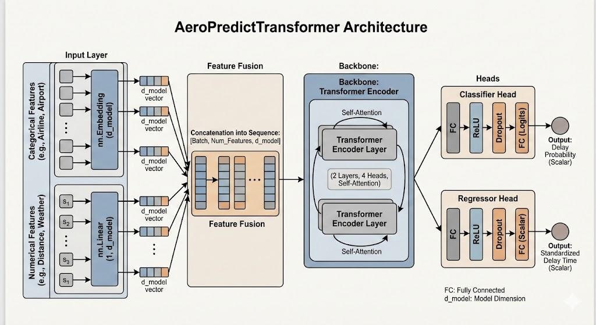

# AeroPredict: Transformer Based Real-Time Flight Delay Predictor

This project is a flight delay prediction system based on Transformers. It utilizes a Multi-Task Learning (MTL) framework to simultaneously solve two problems:

1. **Classification Task:** Predict whether a flight will be delayed (logits, the probability).

2. **Regression Task:** Predict the exact delay time (in minutes).

## 📋 Project Overview

### Core Features

* **Multi-Task Learning (MTL):** The model shares a common underlying feature extraction network, which then branches into a Classifier Head and a Regressor Head, optimizing Accuracy and MAE simultaneously.

* **Tabular Transformer:** A Transformer architecture designed specifically for tabular data, using Embeddings for categorical features and Linear Projection for numerical features.

* **Complete Data Pipeline:** Includes data extraction, data cleaning, leakage-proof feature engineering, data standardization, and PyTorch Dataset encapsulation.

* **Baseline Comparison:** Integrates Random Forest as a strong baseline to benchmark the performance of the deep learning model.

### File Structure

* `extract.py`: Extract the raw data via **Aviationstack** and **Open-Meteo**, in which extract both flights information and weather information. 

* `raw_flights_data_10k.csv`: The raw data extracted by `extract.py`. We get 10K various and different flights data in 2024 to ensure the high quality of our dataset.

* `main.ipynb`: The core file for our project, which includes data processing and cleaning, model defination, model training and evaluation, and baselines comparison. Detailed content can be find in it.

* `environment.yml`: Environment needed for our project.

* `main.md` and `main.pdf`: The original output from our experiment.

## 🚀 Quick Start

Clone the repository to your local machine and set up the environment:

```powershell
git clone https://github.com/Resurgamm/AeroPredict.git
cd AeroPredict
conda env create -f environment.yml
```

Before run `extract.py`, you need to get an Aviationstack API key and replace 

```py
AVIATIONSTACK_API_KEY = 'YOUR_AVIATIONSTACK_API_KEY'  # Replace with your Aviationstack key
```

with your own API key.

You can also directly use `raw_flights_data_10k.csv` we provided, or change `extract.py` to extract more information or other years.

Click `main.ipynb` and have fun!

### Execution Flow

1. **Data Extraction:** Automatically extracts 10K records of real flight data, including airports, schedules, weather, etc.

2. **Data Preprocessing:**

    * **Data Cleaning:** Removes unused features and "future features" (like actual arrival time) to prevent data leakage.
   
    * **Label Construction:** Creates classification labels (is_delayed) and regression labels (DEP_DELAY).


    * **Standardization:** Applies StandardScaler to numerical features.

    * **Encoding:** Applies Label Encoding to categorical features.
    
3. **Model Training:** 
    
    * Train our model named AeroPredictTransformer.
    
    * Loss Function: Loss = BCEWithLogitsLoss (Classification) + MSELoss (Regression).
    
    * Includes learning rate decay strategy (ReduceLROnPlateau).

4. **Evaluation:** Outputs Classification Accuracy, AUC, and Regression Mean Absolute Error (MAE).

5. **Baseline Comparison:** Trains Random Forest Classifier and Regressor and Gradient Boosting Machine (GBM) Classifier and Regressor, outputting comparative metrics.

## 🧠 Model Architecture

The model uses an our defined **AeroPredictTransformer** architecture:

1. **Input Layer:**
   
    * **Categorical Features:** Mapped to `d_model` dimensional vectors via `nn.Embedding`.

    * **Numerical Features:** Projected to vectors of the same dimension via `nn.Linear(1, d_model)`.

2. **Feature Fusion:**
   
    * **Concatenates all feature vectors into a sequence:** `[Batch, Num_Features, d_model]`.
  
3. **Backbone:**
   
    * **Transformer Encoder:** Uses Self-Attention mechanisms to capture global interactions between features (2 Layers, 4 Heads).

4. **Heads:**
   
    * **Classifier Head:** FC -> ReLU -> Dropout -> FC (Logits) -> Outputs delay probability.

    * **Regressor Head:** FC -> ReLU -> Dropout -> FC (Scalar) -> Outputs standardized delay time.


  
## 📊 Performance Metrics

After running the script, you will see output similar to the following:

```bash
=== Transformer Evaluation (Full Features) ===
Accuracy : 0.6190
ROC AUC  : 0.6269
MAE      : 27.19 min

=== Baseline 1: Random Forest (Full Features) ===
Accuracy : 0.6120
ROC AUC  : 0.6193
MAE      : 28.15 min

=== Baseline 2: Gradient Boosting (Full Features) ===
Accuracy : 0.6140
ROC AUC  : 0.6298
MAE      : 27.29 min
```

The final results demonstrate that our model achieves higher classification accuracy and lower regression bias compared to the baselines.
